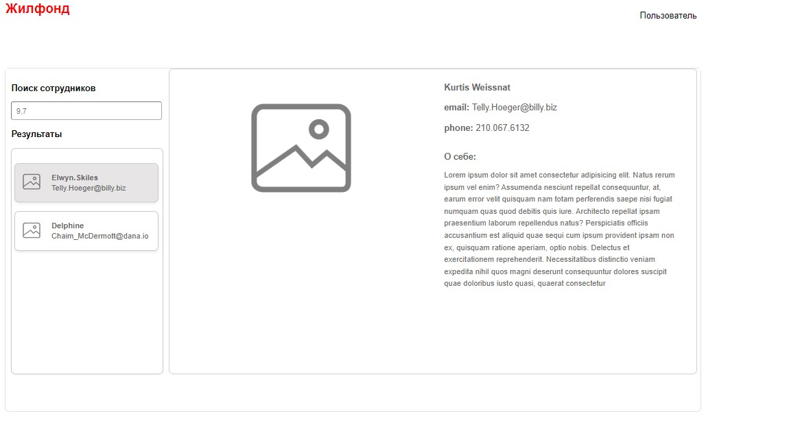

# Справочник сотрудников

Реализована страница поиска сотрудников, с предпросмотром профиля.
Приложение состоит из двух страниц, в боковой секции осуществляется поиск и отображение результатов.
На главной, справа, отображается выбранная карточка пользователя с личными данными.

## Технологический стек

- **Frontend**: Vue.js 3 Composition, Vuex для управления состоянием, SCSS для стилей.
- **API**: Допустим, вы использовали [JSONPlaceholder](https://jsonplaceholder.typicode.com/) для имитации API.
- **Инструменты разработки**: ESLint для статического анализа кода, Git для контроля версий.

## Особенности проекта

- SPA (Single Page Application) для поиска сотрудников.
- Использование Composition API Vue 3 для организации логики компонентов.
- Никакие UI библиотеки не использованы, компоненты создавались вручную.
- Изоляция стилей с помощью SCSS и `<style scoped>` для компонентов.
- Реализована обработка ошибок при запросах к API.
- Прелоадеры для индикации загрузки данных.
- Внедрена возможность искать одновременно несколько сотрудников, перечислив их через знак запятой.
- Можно искать по id, можно искать по username.
- Адаптивный дизайн отсутствует, поскольку не предусмотрен требованиями задания.

## Запуск проекта

Для запуска проекта на вашем локальном компьютере следуйте инструкциям:

1. Клонируйте репозиторий:
   git clone https://github.com/ваш_логин/test-task-21032024.git
2. Перейдите в директорию проекта:
   cd test-task-21032024
3. Установите зависимости:
   npm install
4. Запустите проект:
   npm run serve

## Демонстрация

## Контактная информация

Для связи со мной:
Telegram: vermarvel
email: maria.verma.webdev@gmail.com
